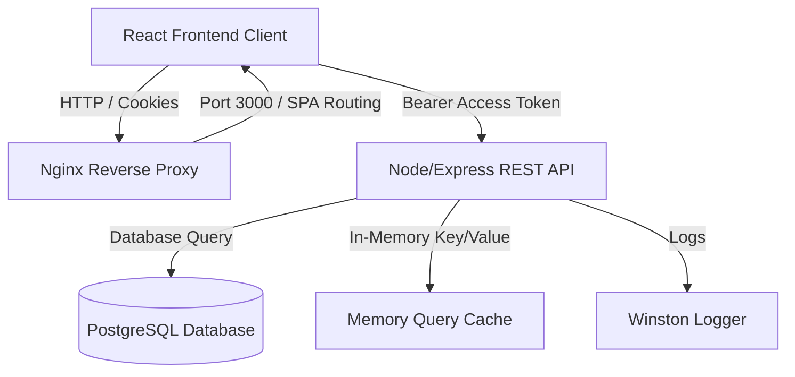

# 🚀 Primetrade.ai - Task Workspace Platform
 
**🟢 Live Demo (Deployed):** [Click here to open the live website](https://primetrade-frontend-r5vs.onrender.com/login)
<h3 align="center">
  <span style="color:red;">⚡ Use the built-in autofill buttons on the login screen for instant access!</span>
</h3>

[](docker-compose.yml)
[](backend/package.json)
[](frontend/package.json)
[](backend/prisma/schema.prisma)
[](backend/docs/swagger.yaml)

A production-ready, highly-scalable, Task Manager website featuring **REST API with Authentication & Role-Based Access Control (RBAC)** accompanied by a premium **React frontend client**. Engineered  to demonstrate secure backend designs, DB modeling, performance caching, error boundaries, and Docker/Cloud infrastructure orchestration.

---

## 📸 System Architecture



---

## ✨ Features Implemented

### 🔒 Core Backend & Security (Primary)
- **Token Rotation Authentication**: Access Token (15-min lifespan, stored in frontend memory) + HttpOnly/Secure Refresh Token (7-day lifespan, cookie-stored).
- **Role-Based Access Control (RBAC)**: Strict separation of privileges between `USER` and `ADMIN`.
- **Query & Write Cache**: Standardized memory cache invalidation (read-through/write-through cache) to optimize retrieval performance of task listings.
- **Robust Schema Validation**: Runtime JSON validation of parameters, query bounds, and payloads via `Zod`.
- **API Versioning & Resilience**: Root-configured global routers under `/api/v1/` with error boundary tracking and custom `ApiError` handlers.
- **Rate-Limiting Protection**: Prevent DDoS and credential stuffing with Express IP rate-limiters (100 requests per 15 minutes overall, 5 attempts per 15 minutes for auth endpoints).

### 🖥️ Responsive Console UI (Supportive)
- **Modern Glassmorphism Theme**: Customized slate-dark dashboard using custom CSS tokens, smooth hover micro-animations, and Outfit sans-serif typeface.
- **Autologin & Session Recovery**: Attempts token refresh automatically on page load to restore user dashboard session.
- **Quick Autofill Controls**: Dynamic login helpers that auto-fill User/Admin credentials with one-click.
- **Paginated Datagrid & Modals**: Smooth task creation and editing modals with client-side status toggles.
- **Global Administrator Suite**: Exclusive admin view featuring:
  - Users database table displaying each account, registered date, and task counts.
  - Role management (USER ⇆ ADMIN toggling) and deletion tools.
  - Global task logs for reviewing/editing task records across all accounts.

---

## 🛠️ Technology Stack

- **REST API**: Node.js, Express, Prisma ORM, PostgreSQL.
- **Validation & Auth**: JWT (jsonwebtoken), Zod, bcrypt (password hashing), cookie-parser.
- **UI Client**: React 19, Vite, Axios (with authorization interceptors), Lucide-React.
- **Caching & Logs**: node-cache, Winston logging.
- **Infrastructure**: Docker, Nginx, Render Blueprint IaC (`render.yaml`).

---

## 🚀 Quick Start (Local Docker Sandbox)

The easiest way to get the database, API server, and React UI running locally is using Docker Compose.

### Prerequisites
- [Docker Desktop](https://www.docker.com/products/docker-desktop/) installed and running.

### Spin up the Stack
1. Clone this repository and navigate to the directory:
   ```bash
   cd primetrade_assignment
   ```
2. Build and run the containers:
   ```bash
   docker-compose up --build
   ```
3. Docker Compose will automatically boot the database, run Prisma push schema syncing, run the data seeding script, and launch:
   - **Frontend UI**: [http://localhost:3000](http://localhost:3000)
   - **Backend API**: [http://localhost:5000](http://localhost:5000)
   - **Swagger Docs**: [http://localhost:5000/api-docs](http://localhost:5000/api-docs)

---

## 🔑 Recruiter Quick Login (Demo Credentials)

Use the built-in autofill buttons on the login screen, or enter the seeded credentials:

| Role | Username / Email | Password | Access Rights |
| :--- | :--- | :--- | :--- |
| **USER** | `user@primetrade.ai` | `User@123` | Create, view, edit & delete own tasks. |
| **ADMIN** | `admin@primetrade.ai` | `Admin@123` | Access users catalog, edit roles, manage global tasks. |

---

## 🗂️ API Documentation & Testing

### 1. Swagger Interactive Sandbox
When running the backend service, navigate to:
```
http://localhost:5000/api-docs
```
This serves the interactive OpenAPI 3.1 Swagger interface generated directly from the YAML specs in [`backend/docs/swagger.yaml`](backend/docs/swagger.yaml).

### 2. Postman Collection Import
A comprehensive Postman test suite with pre-request scripts, variable hooks, and token capture logic is included:
- **Location**: [`backend/docs/primetrade-api.postman_collection.json`](backend/docs/primetrade-api.postman_collection.json)
- **Import Instructions**:
  1. Open Postman and click **Import**.
  2. Choose the JSON collection file.
  3. Running `Register User`, `Login User`, or `Login Admin` will automatically set the `{{access_token}}` variable so all other CRUD calls function out of the box!

---

## 📦 Manual Setup (Development Mode)

If you wish to run the backend and frontend separately outside Docker:

### 1. PostgreSQL Database
Ensure you have a PostgreSQL database instance running and update the `DATABASE_URL` in `backend/.env` file. (Refer to [`backend/.env.example`](backend/.env.example))

### 2. Run Backend API
```bash
cd backend
npm install
npx prisma db push
npx prisma db seed
npm run dev
```

### 3. Run Frontend Client
```bash
cd frontend
npm install --legacy-peer-deps
npm run dev
```
Open [http://localhost:3000](http://localhost:3000) in your browser.

---

## 📁 Repository Structure

```
primetrade_assignment/
├── backend/
│   ├── docs/                   # OpenAPI Specs & Postman Collections
│   ├── prisma/                 # PostgreSQL Prisma Schema & Seed script
│   ├── src/
│   │   ├── config/             # DB, env, logger setups
│   │   ├── middleware/         # RBAC, Rate-limiters, Validations
│   │   ├── modules/            # Auth, Tasks, and Users directories
│   │   └── utils/              # Standard responses/errors helpers
│   ├── Dockerfile
│   └── package.json
├── frontend/
│   ├── src/
│   │   ├── api/                # Axios interceptors & clients
│   │   ├── components/         # Protected routes, layout, buttons
│   │   ├── context/            # Auth session context state
│   │   ├── pages/              # Dashboard, login, admin panels
│   │   └── index.css           # Premium vanilla CSS variables & layouts
│   ├── Dockerfile
│   ├── nginx.conf              # SPA route router fallback
│   └── package.json
├── docker-compose.yml          # Local multi-container compose orchestrator
├── render.yaml                 # Infrastructure as Code cloud blueprint
└── SCALABILITY.md              # Production transition roadmap
```

---

## 🚀 Cloud Deployment Roadmap

This application is ready to deploy to the cloud:
- **Backend & Database**: Render web service and database (configured in [`render.yaml`](render.yaml)).
- **Frontend Client**: Vercel or Render Static Site.
- Simply click "New Blueprint" on Render and link this repository !


