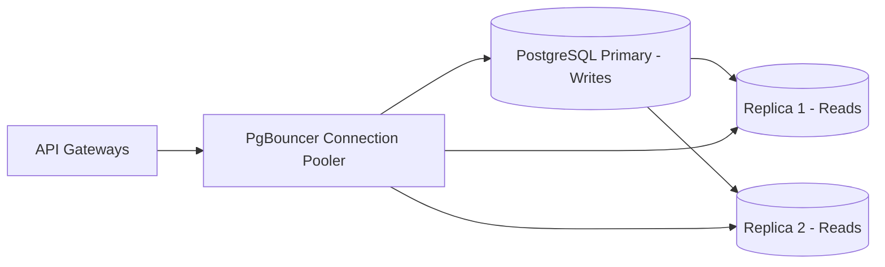
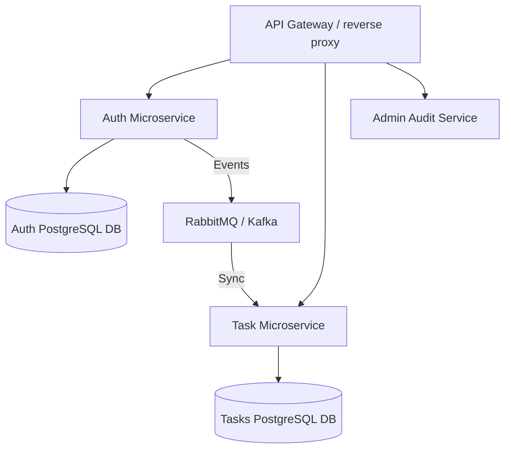

# 📈 System Scalability & Production-Readiness Roadmap

This document outlines the architectural blueprints, technical considerations, and migration paths to scale the **Primetrade Task Platform** from a prototype environment to support millions of active users and heavy transactional traffic.

---

## 1. 💾 Database Scaling

As the active user base grows, the database will inevitably become the primary bottleneck. The following measures should be introduced:

### Connection Pooling (PgBouncer)
- **Current Issue**: Prisma opens a direct connection pool per server instance. In serverless/auto-scaled environments, this quickly exceeds PostgreSQL's max connection limits.
- **Production Path**: Deploy **PgBouncer** between the API layer and the PostgreSQL database. Configure it in *transaction pooling mode* to reuse database connections efficiently.

### Read/Write Segregation (Read Replicas)
- **Current Issue**: Read queries (fetching task lists) compete with write operations (updating statuses, user registration).
- **Production Path**: Provision read replicas for PostgreSQL. Update the Prisma configuration to use a routing client (like Prisma's read-replica extension) to send writes to the Primary DB and reads to the Replicas.

### Horizontal Partitioning (Sharding)
- **Current Issue**: The `Task` table grows linearly with the number of tasks, slowing down index lookups even with proper B-Tree indexing.
- **Production Path**: Partition the `Task` table horizontally based on a tenant key (e.g., `userId` or a company ID range) or partition tables by hash. This splits the data into smaller, manageable chunks across different database shards.

---

## 2. ⚡ Distributed Caching (Redis Upgrade)

The application currently uses an in-memory cache (`node-cache`) local to each Express process.

### Memory Cache Limitations
1. **No Shared State**: When scaling horizontally to multiple API instances, caches become out of sync (e.g., updating a task on Server A doesn't invalidate cache on Server B).
2. **Memory Exhaustion**: The API container memory is consumed by cached objects rather than processing connections.

### Upgrade Blueprint: Redis Cluster
- **Implementation**: Replace the `node-cache` helper with `ioredis` pointing to an auto-scaling Redis cluster.
- **Cache Strategy (Cache-Aside)**:
  - Cache task listings under `tasks:{userId}:{filtersHash}`.
  - Set an explicit TTL (e.g., 10 minutes) and use standard invalidation prefixes.
  - Implement a **Redis Pub/Sub** or event-driven hook using webhooks/queues to broadcast cache invalidation events across all nodes instantly.

---

## 3. 🛡️ Advanced Security Operations

### CSRF Protection
- **Vulnerability**: Since the `refreshToken` is stored in an HttpOnly cookie, it is vulnerable to Cross-Site Request Forgery (CSRF) on endpoints that rely on it (like `/auth/refresh` or `/auth/logout`).
- **Solution**: Implement double-submit cookie pattern or generate an anti-CSRF token on the backend sent via headers that must match the request token payload.

### JWT Storage Security
- **Current Design**: The `accessToken` is stored in React memory (secure against XSS) and the `refreshToken` is in an HttpOnly cookie (secure against XSS, vulnerable to CSRF).
- **Advanced Path**: Use standard authorization headers or single-session tokens stored in secure, encrypted browser session memory, with a strict Content Security Policy (CSP) blocking external scripts from stealing session metadata.

### Rate-Limiting & WAF (Cloudflare)
- **Production Path**: Move rate-limiting out of the application code (Express middleware) to the network edge using **Cloudflare** or **AWS WAF**. This blocks malicious DDoS and bot traffic before it reaches the backend servers, conserving server resources.

---

## 4. 🔀 Transition to Microservices

As the backend expands, separating functionalities into dedicated services simplifies maintenance and prevents single-point-of-failures (SPOFs).

### Microservices Roadmap
1. **API Gateway**: Use Kong or AWS API Gateway to handle routing, rate-limiting, and CORS centrally.
2. **Auth Service**: Isolate token generation, registration, and user profiles. Uses a lightweight database containing user accounts and roles.
3. **Tasks Service**: Deals purely with task records. Requires token signature validation (using a shared JWT key or JWKS endpoints) to authenticate requests.
4. **Asynchronous Communication**: Introduce **Apache Kafka** or **RabbitMQ** to publish events (e.g., `USER_DELETED`, `USER_REGISTERED`) to sync state between service boundaries without blocking HTTP chains.

---

## 5. 📊 Observability & APM

To run a high-traffic production system, you must know what is failing before the users report it.

- **Distributed Tracing**: Integrate **OpenTelemetry** with APM platforms like **Datadog** or **New Relic** to track the latency of API calls down to the exact database queries.
- **Log Aggregation**: Route Express Winston logs to a central server using the **ELK Stack** (Elasticsearch, Logstash, Kibana) or **Grafana Loki**.
- **Real-Time Error Tracking**: Integrate **Sentry** in both the React frontend and Express backend to catch and alert on runtime unhandled exceptions instantly.
